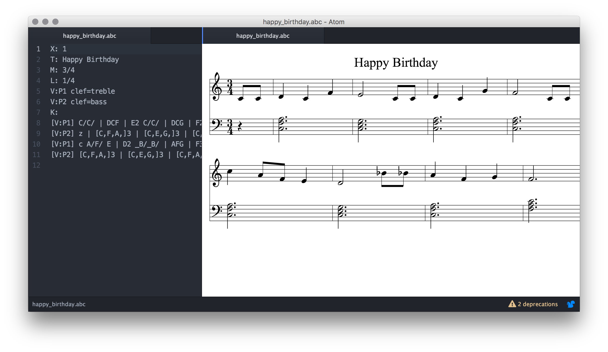
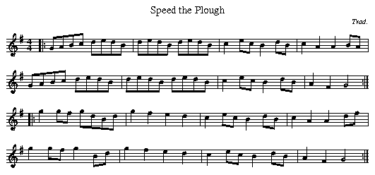

#atom-abc-preview

An [ATOM](https://atom.io) package for previewing [abc notations](http://abcnotation.com/wiki/abc:standard:v2.1).



##What is abc?
>Abc is a text-based music notation system designed to be comprehensible by both people and computers. Music notated in abc is written using characters - letter, digits and punctuation marks - on paper or in computer files. [1]

###Example
```
X:1
T:Speed the Plough
M:4/4
C:Trad.
K:G
|:GABc dedB|dedB dedB|c2ec B2dB|c2A2 A2BA|
  GABc dedB|dedB dedB|c2ec B2dB|A2F2 G4:|
|:g2gf gdBd|g2f2 e2d2|c2ec B2dB|c2A2 A2df|
  g2gf g2Bd|g2f2 e2d2|c2ec B2dB|A2F2 G4:|
```


*Source: [2]*

##What is ATOM?
>Atom is a text editor that's modern, approachable, yet hackable to the core—a tool you can customize to do anything but also use productively without ever touching a config file. [3]

##References
1. http://abcnotation.com/wiki/abc:standard:v2.1#introduction
2. http://abcnotation.com
3. https://atom.io
